<p align="center">
  <h1 align="center">Viralix</h1>
  <p align="center"><strong>AI-Powered Multi-Platform Social Media Management Platform</strong></p>
  <p align="center">Schedule · Publish · Sync · Analyze across Instagram, Facebook, TikTok & YouTube</p>
  <p align="center">
    
    
    
    
    
  </p>
</p>

---

## Table of Contents

1. [Executive Summary (For Recruiters & Hiring Managers)](#1-executive-summary-for-recruiters--hiring-managers)
2. [Engineering Highlights](#2-engineering-highlights)
3. [Product Capabilities](#3-product-capabilities)
4. [Technology Stack](#4-technology-stack)
5. [Repository Structure](#5-repository-structure)
6. [System Architecture Diagrams](#6-system-architecture-diagrams)
   - 6.1 [System Context](#61-system-context)
   - 6.2 [Container Architecture](#62-container-architecture-c4-level-2)
   - 6.3 [Deployment Topology](#63-deployment-topology)
   - 6.4 [Modular Monolith Internals](#64-modular-monolith-internals)
   - 6.5 [API Request Lifecycle](#65-api-request-lifecycle)
   - 6.6 [Publishing Pipeline](#66-publishing-pipeline)
   - 6.7 [Analytics Pipeline](#67-analytics-pipeline)
   - 6.8 [Platform Sync Pipeline](#68-platform-sync-pipeline)
   - 6.9 [Domain Events — Outbox + Kafka](#69-domain-events--outbox--kafka)
   - 6.10 [Queue Topology](#610-queue-topology-bull--redis)
   - 6.11 [Scheduler Distributed Lock](#611-scheduler-distributed-lock)
   - 6.12 [Webhook Ingestion](#612-webhook-ingestion)
   - 6.13 [Caching & Read Replicas](#613-caching--read-replica-strategy)
   - 6.14 [Data Storage Map](#614-data-storage-map)
   - 6.15 [Observability](#615-observability-architecture)
   - 6.16 [Security & Multi-Tenancy](#616-security--multi-tenancy)
   - 6.17 [Analytical Data Flow](#617-analytical-data-flow)
   - 6.18 [Evolution Path](#618-evolution-path-modular-monolith-to-services)
   - 6.19 [Phase Rollout Map](#619-phase-rollout-map)
   - 6.20 [Local Development Topology](#620-local-development-topology)
7. [System Design Decisions](#7-system-design-decisions)
8. [Backend Architecture](#8-backend-architecture)
9. [Advanced Infrastructure Services](#9-advanced-infrastructure-services)
10. [Platform Graph API Integration](#10-platform-graph-api-integration)
11. [Frontend Architecture & Pages](#11-frontend-architecture--pages)
12. [Frontend ↔ Backend Integration Flows](#12-frontend--backend-integration-flows)
13. [Complete Backend API Catalog](#13-complete-backend-api-catalog)
14. [Services Layer Reference](#14-services-layer-reference)
15. [Additional System Flow Diagrams](#15-additional-system-flow-diagrams)
16. [Data Models](#16-data-models)
17. [Operations Runbook](#17-operations-runbook)
18. [Getting Started](#18-getting-started)
19. [Testing & Load](#19-testing--load)
20. [Deployment](#20-deployment)
21. [Supplementary Documents](#21-supplementary-documents)

---

## 1. Executive Summary (For Recruiters & Hiring Managers)

**Viralix** is a production-oriented, **multi-tenant SaaS** for social media operations. Creators and marketers connect Instagram, Facebook, TikTok, and YouTube accounts, then create, schedule, publish, sync, and analyze content from a unified dashboard.

Unlike typical portfolio projects (todo apps, basic CRUD APIs), Viralix implements **distributed systems patterns** found in growth-stage and large-scale backends:

| Pattern | Implementation |
|---------|----------------|
| Async worker pipelines | Bull queues: publish, platform-sync, analytics-refresh |
| Reliability | Idempotency keys, DLQ + replay, circuit breakers, webhook dedupe |
| Scale controls | Redis rate limiting, per-tenant quotas, queue admission/backpressure |
| Scheduler safety | Distributed Redis lock — single leader across replicas |
| Read optimization | Materialized analytics, daily rollups, Redis cache-aside, Mongo read replicas |
| Event-driven | MongoDB outbox + **Kafka** domain event stream |
| Observability | Structured JSON logs, Prometheus metrics, W3C trace propagation, OTEL hooks |
| Security | JWT, RBAC, audit logs, AES-256 token encryption |

**Architecture style:** Modular monolith with explicit domain module seams (`publishing`, `analytics`, `platformSync`) and **separate API vs worker processes** — designed for horizontal scaling without premature microservices.

**Repository:** [github.com/zeeshan-890/viralix](https://github.com/zeeshan-890/viralix)

---

## 2. Engineering Highlights

### Reliability & Consistency
- **Idempotency** on publish, platform sync, and webhooks (`idempotency-key` header + Mongo unique indexes)
- **Publish DLQ** with admin replay API (`GET/POST /api/posts/dlq`)
- **Circuit breaker** per external platform API in publish worker
- **Webhook idempotency** — Redis fast dedupe + `WebhookEvent` durable store
- **At-least-once** job processing with safe retries (not exactly-once — by design)

### Performance & Scale
- **Queue partitioning** — separate Bull queues prevent workload starvation
- **Admission control** — reject enqueue when queue depth exceeds env limits (429)
- **Materialized analytics** — `AnalyticsOverviewSnapshot` + Redis cache; no live aggregation on every dashboard load
- **Daily rollups** — `AnalyticsDailyRollup` for 90d/1y trends without scanning all posts
- **Connected accounts cache** — Redis cache-aside with invalidation on connect/disconnect

### Operations & Observability
- **Process split** — `PROCESS_TYPE=api` vs `PROCESS_TYPE=worker` (Heroku Procfile, K8s manifests)
- **Health endpoint** — `GET /api/health` reports Mongo, Redis, Kafka, read replica status
- **Prometheus** — `GET /api/metrics` with HTTP, queue, scheduler metrics
- **Trace IDs** — `x-trace-id` + `traceparent` propagated API → queue → worker
- **51+ unit tests** on infra paths (rate limiter, idempotency, circuit breaker, Kafka, etc.)

### Event Backbone
- **Kafka** publishes domain lifecycle events to `viralix.domain-events` (publish completed/failed, sync completed, analytics materialized)
- **Outbox-lite** — events persisted to `DomainEvent` collection before bus publish
- Job queues remain on **Bull/Redis** — Kafka is for events, not task execution

---

## 3. Product Capabilities

### Content & Publishing
- Multi-platform post CRUD with rich media (Cloudinary), hashtags, scheduling
- **Factory + Strategy publishers** for Facebook, Instagram, TikTok, YouTube
- Parallel platform fan-out with independent per-platform status tracking
- Cron scheduler enqueues due posts every minute (with distributed lock)

### Analytics
- Dashboard overview with platform breakdown and engagement rate
- Async analytics refresh jobs with status polling
- Deep per-platform analytics (TikTok, Instagram native metrics)
- Long-range trends API (`GET /api/analytics/trends?days=90`)
- Performance charts use rollups for 90d/1y periods

### Platform Integration
- OAuth 2.0 for Meta, TikTok, YouTube with HMAC-signed stateless state tokens
- Async platform sync jobs (content + metrics pull into MongoDB)
- Webhook-driven Instagram/Facebook auto-reply automation
- Token encryption at rest (AES-256-CBC)

### AI & Automation
- Gemini-powered captions, hashtags, text rewrite (rate-limited + tenant quota)
- Auto-reply rules with keyword triggers and duplicate prevention
- Inbox, bio pages, hashtag research, team management, bulk upload

### Admin & Enterprise-Ready Foundations
- RBAC (`requireRole('admin')`) on audit and domain event query routes
- `AuditLog` trail for publish, sync, DLQ replay actions
- Per-tenant quotas (publish/day, sync/hour, AI/minute, analytics refresh/hour)

---

## 4. Technology Stack

### Backend (`backend/`)

| Category | Technology |
|----------|------------|
| Runtime | Node.js 18+ |
| Framework | Express.js |
| Database | MongoDB + Mongoose (optional read replica via `MONGODB_READ_URI`) |
| Queue / Cache / Locks | Redis + Bull + ioredis |
| Events | Kafka / Redpanda (kafkajs) |
| Auth | JWT, OAuth 2.0, bcrypt |
| Encryption | AES-256-CBC for OAuth tokens |
| Media | Cloudinary |
| AI | Google Gemini |
| Email | Nodemailer (SMTP) |
| Observability | prom-client, OpenTelemetry API hooks, structured JSON logs |
| Testing | Jest |
| Scheduling | node-cron + distributed Redis lock |

### Frontend (`frontend/`)

| Category | Technology |
|----------|------------|
| Framework | Next.js 15 (App Router), React 19 |
| Styling | Tailwind CSS 4 |
| State | Zustand 5, TanStack React Query 5 |
| Forms | React Hook Form + Zod |
| UI | Radix UI, Lucide icons, Recharts |
| HTTP | Axios (`src/lib/api.js`) |

---

## 5. Repository Structure

```
Viralix/
├── frontend/                    # Next.js 15 client
│   ├── app/                       # App Router pages (dashboard, auth, landing)
│   └── src/
│       ├── components/            # UI, analytics, layout
│       ├── lib/api.js             # Centralized API client
│       └── store/                 # Zustand stores
│
├── backend/
│   ├── server.js                # Express API (PROCESS_TYPE=api)
│   ├── worker-process.js          # Workers + scheduler + Kafka consumer
│   ├── routes/                    # 25+ REST route modules
│   ├── services/
│   │   ├── queue/                 # publish, sync, analytics workers
│   │   ├── analytics/             # materialize, rollups, trends adapter
│   │   ├── events/                # Kafka publisher, consumer, envelopes
│   │   └── publishers/            # Platform publisher strategy pattern
│   ├── modules/                   # publishing, analytics, platformSync seams
│   ├── models/                    # Mongoose schemas
│   ├── middleware/                # auth, rateLimiter, trace, tenantQuota, requireRole
│   ├── config/                    # database, redis, kafka, metrics, tracing
│   └── ops/
│       ├── deploy/                # Docker, K8s HPA, Render, docker-compose
│       ├── monitoring/            # Prometheus, Grafana, alerts
│       ├── load/                  # smoke + read load tests
│       └── chaos/                 # circuit breaker drill
│
├── SYSTEM_DESIGN_ARCHITECTURE.md  # Extended diagram reference (duplicate of §6)
├── SYSTEM_DESIGN_MILLION_USERS_PLAN.md  # Full runbooks + yes/no matrix
├── Procfile                       # Heroku web + worker dynos
└── README.md                      # This file
```

---

## 6. System Architecture Diagrams

All diagrams reflect the **current implemented architecture** (modular monolith + async workers + Kafka domain events).

### 6.1 System Context

Who interacts with Viralix and which external systems it depends on.

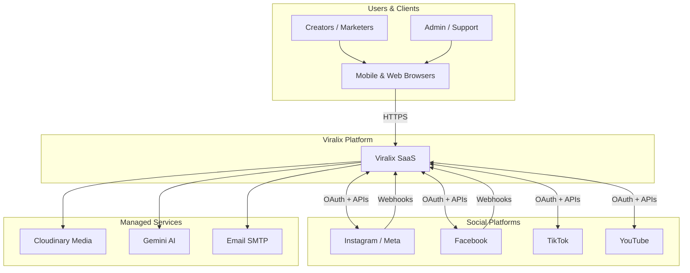

---

### 6.2 Container Architecture (C4 Level 2)

Major deployable units and how they connect.

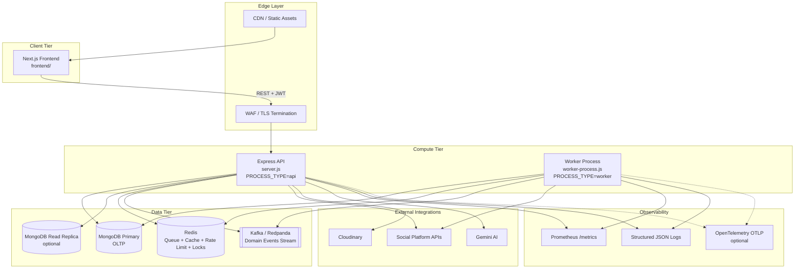

---

### 6.3 Deployment Topology

How processes scale in production (Heroku, Kubernetes, or Docker Compose).

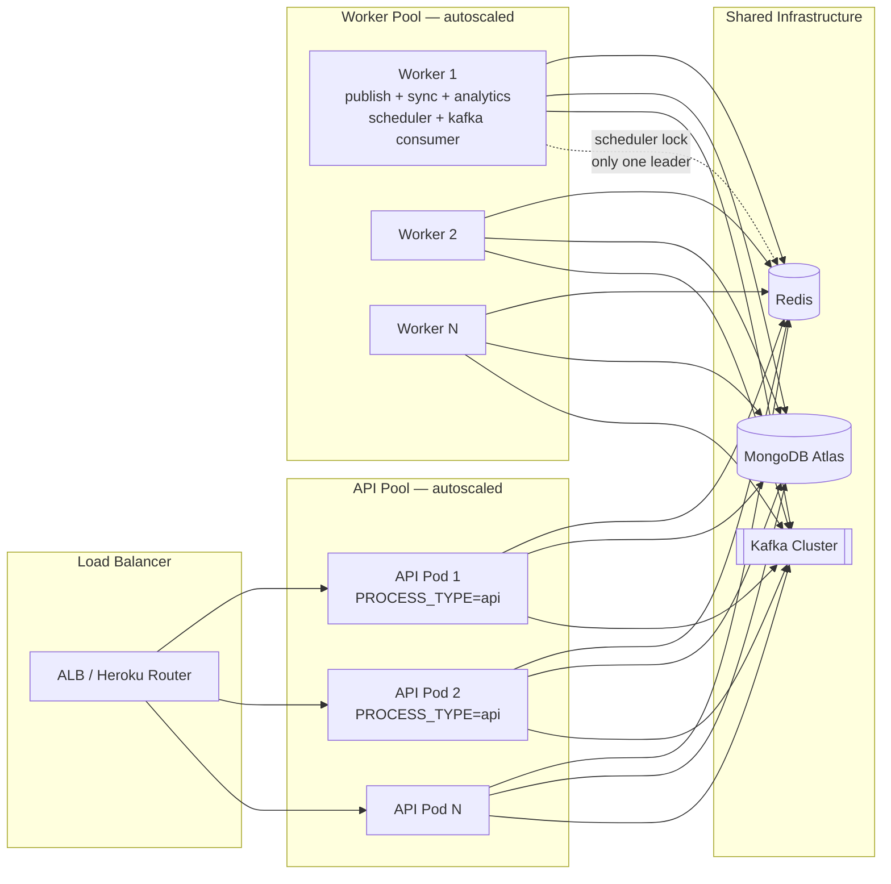

**Key split:** API handles HTTP only; workers handle Bull queues, cron scheduler (with distributed lock), and optional Kafka consumer.

---

### 6.4 Modular Monolith Internals

Domain modules inside the backend and their seams for future extraction.

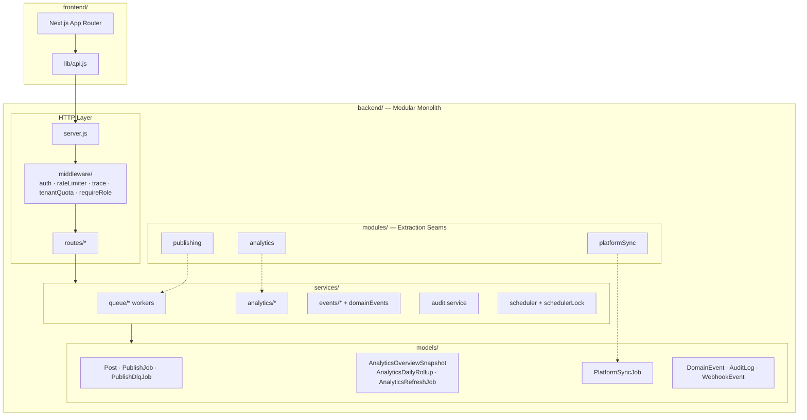

**Module registry:** `backend/modules/index.js` exports `publishing`, `analytics`, `platformSync`.

---

### 6.5 API Request Lifecycle

Path of an authenticated request through cross-cutting concerns.

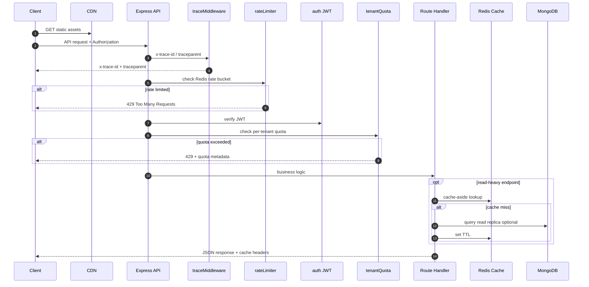

---

### 6.6 Publishing Pipeline

End-to-end flow from publish request to platform APIs and domain events.

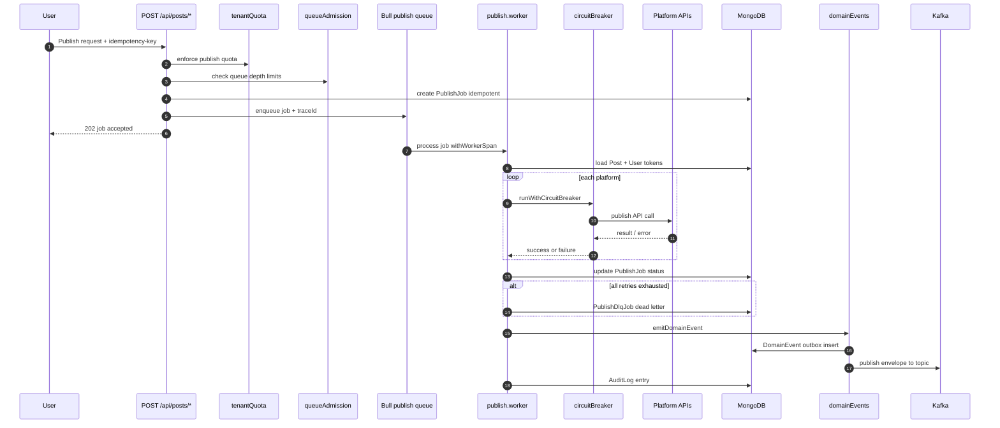

**Publisher pattern:** `BasePublisher` → `PublisherFactory` → Facebook / Instagram / TikTok / YouTube publishers. Parallel execution via `Promise.allSettled`.

---

### 6.7 Analytics Pipeline

Async refresh, materialization, rollups, and read paths.

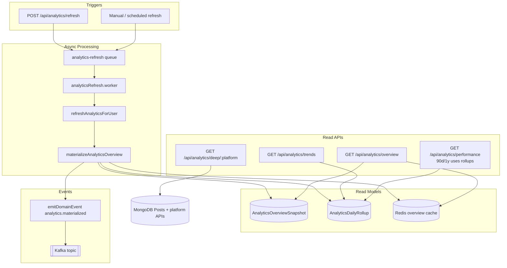

---

### 6.8 Platform Sync Pipeline

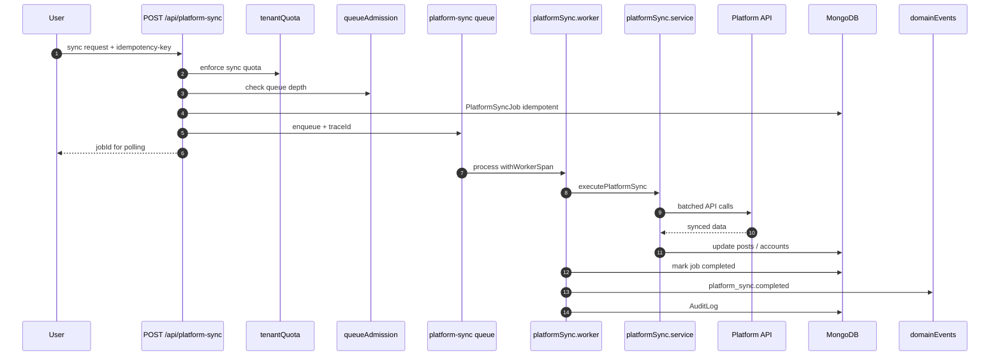

---

### 6.9 Domain Events — Outbox + Kafka

Reliable event emission with Kafka as the stream backbone.

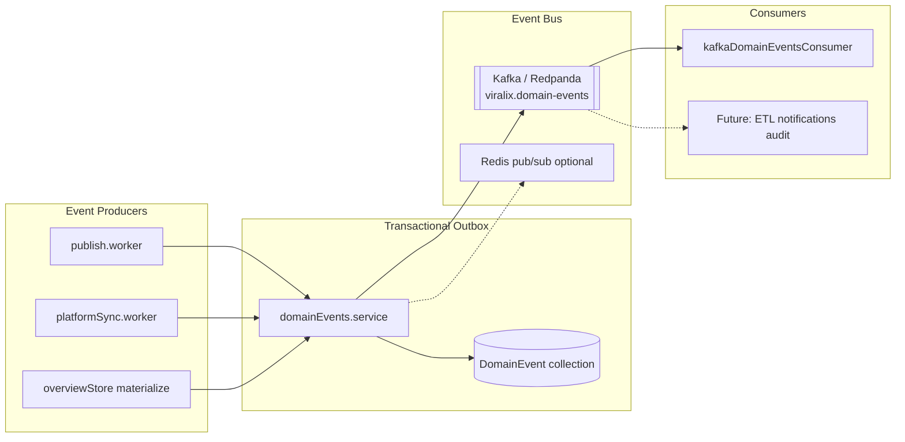

| Event type | Trigger |
|------------|---------|
| `publish.completed` | All platforms published successfully |
| `publish.failed` | All platforms failed |
| `publish.partially_failed` | Mixed results |
| `platform_sync.completed` | Sync worker finished |
| `analytics.materialized` | Overview materialized + rollup upserted |

**Envelope fields:** `eventId`, `eventType`, `userId`, `traceId`, `aggregateType`, `aggregateId`, `payload`, `version`  
**Partition key:** `userId` (per-tenant ordering within partition)

**Important:** Kafka is for **domain events only**. Job execution uses **Bull + Redis**.

---

### 6.10 Queue Topology (Bull + Redis)

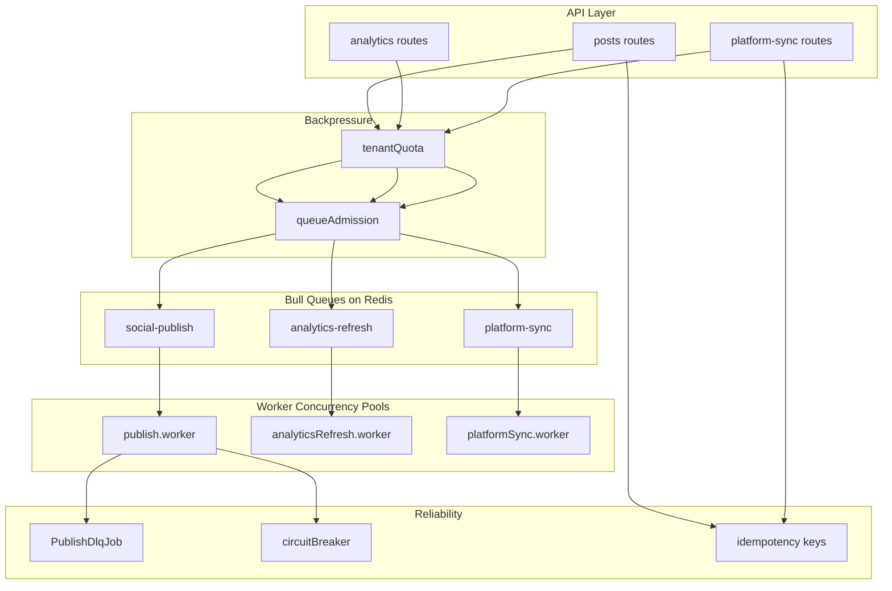

| Queue | Env concurrency | Default |
|-------|-----------------|---------|
| `social-publish` | `PUBLISH_WORKER_CONCURRENCY` | 6 |
| `analytics-refresh` | `ANALYTICS_REFRESH_WORKER_CONCURRENCY` | 2 |
| `platform-sync` | `PLATFORM_SYNC_WORKER_CONCURRENCY` | 3 |

---

### 6.11 Scheduler Distributed Lock

Prevents duplicate scheduled-post execution across replicas.

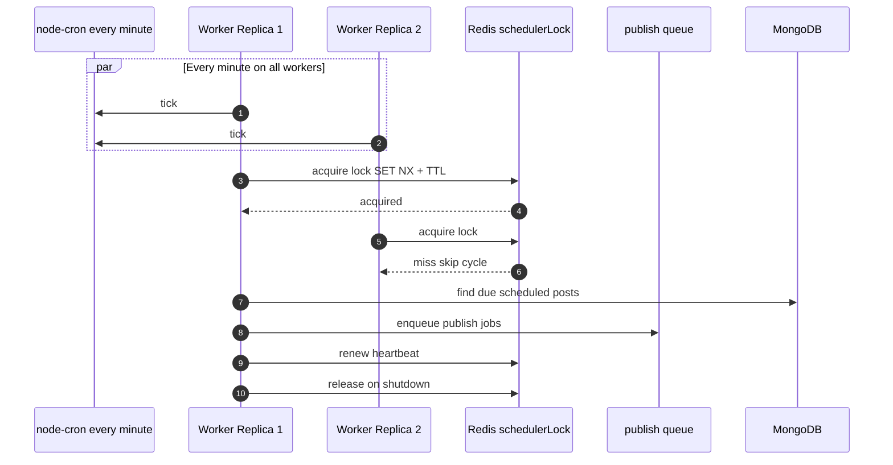

---

### 6.12 Webhook Ingestion

Idempotent processing of Instagram/Facebook webhook events.

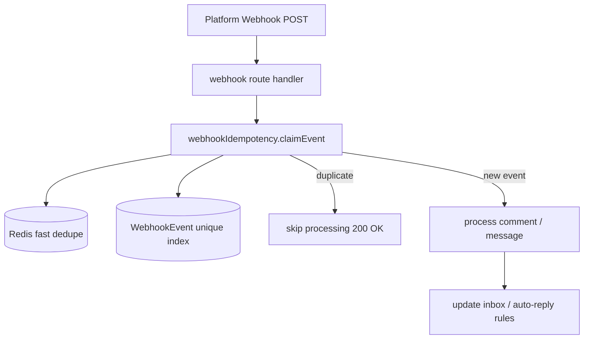

---

### 6.13 Caching & Read Replica Strategy

```mermaid
flowchart TB
    subgraph Reads["Read Paths"]
        R1[/api/analytics/overview]
        R2[/api/platforms/connected]
        R3[/api/audit/logs]
        R4[/api/analytics/trends]
    end

    subgraph Cache["Redis Cache-Aside"]
        C1[overview cache]
        C2[accounts cache]
    end

    subgraph DB["MongoDB"]
        PRIMARY[(Primary writes)]
        REPLICA[(Read Replica)]
    end

    R1 --> C1
    C1 -->|miss| REPLICA
    R1 -->|materialized| SNAP[(AnalyticsOverviewSnapshot)]

    R2 --> C2
    C2 -->|miss| PRIMARY

    R3 --> REPLICA
    R4 --> REPLICA
    R4 --> ROLLUP[(AnalyticsDailyRollup)]

    WRITE[All writes] --> PRIMARY
```

---

### 6.14 Data Storage Map

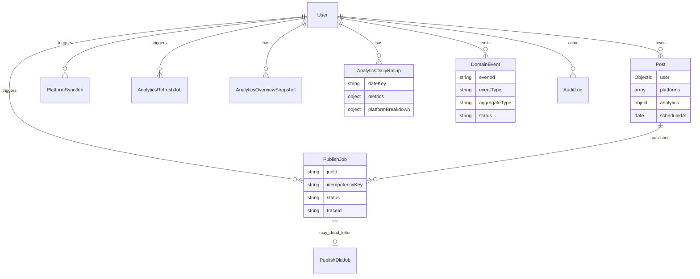

---

### 6.15 Observability Architecture

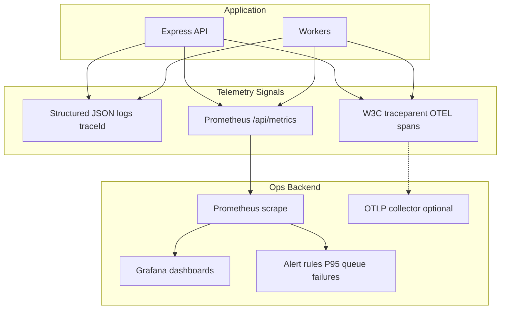

**Key Prometheus series:**
- `viralix_http_request_duration_ms`
- `viralix_queue_depth`
- `viralix_queue_job_duration_ms`
- `viralix_scheduler_lock_events_total`

**Alerts:** `ViralixApiP95LatencyHigh` (>800ms), `ViralixQueueFailureRatioHigh` (>10%)

---

### 6.16 Security & Multi-Tenancy

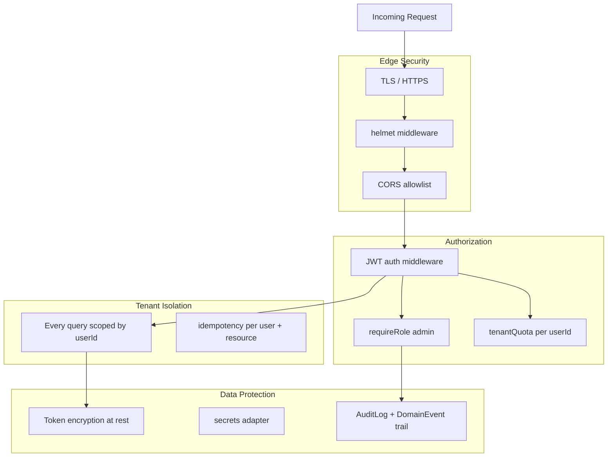

---

### 6.17 Analytical Data Flow

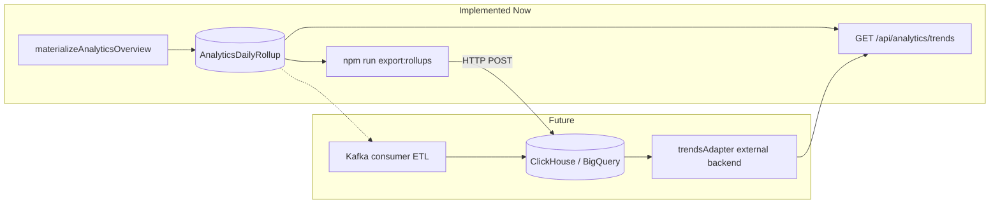

---

### 6.18 Evolution Path (Modular Monolith to Services)

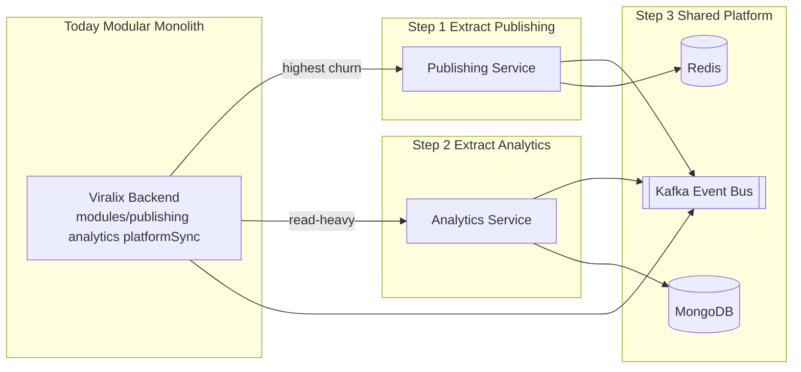

Extract only after queues, cache, observability, and idempotency are mature — **all implemented today**.

---

### 6.19 Phase Rollout Map

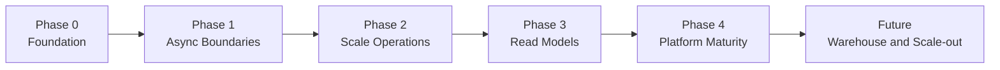

| Phase | Status | Deliverables |
|-------|--------|--------------|
| **Phase 0 — Foundation** | Done | Redis rate limiting, scheduler distributed lock, structured logs, trace IDs, Prometheus metrics, alerts |
| **Phase 1 — Async Boundaries** | Done | Queue partitioning, async analytics refresh, async platform sync, idempotency keys, materialized analytics, cache-aside Redis |
| **Phase 2 — Scale Operations** | Done | Read replicas, per-tenant quotas, DLQ replay, circuit breaker, load and chaos drills, hot-path indexes |
| **Phase 3 — Advanced Read Models** | Done | Domain events outbox, daily rollups, trends API, module boundaries |
| **Phase 4 — Platform Maturity** | Done | OTEL tracing hooks, rollup export stub, Kafka domain events |
| **Future** | Planned | ClickHouse or BigQuery, full microservices, multi-region active-active |

---

### 6.20 Local Development Topology

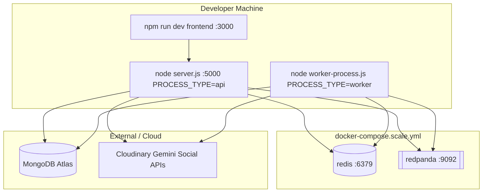

---

## 7. System Design Decisions

### Architecture patterns

| Concept | Decision | Rationale |
|---------|----------|-----------|
| Modular Monolith | **Yes now** | Fastest path; codebase already modularized by routes/services/models |
| Microservices | **Yes later** | Extract publishing/analytics only when throughput or team boundaries demand |
| Event-Driven | **Yes now (partial)** | Queues + Kafka domain events; expand as volume grows |
| CQRS | **Yes later (selective)** | Materialized analytics is selective CQRS; avoid global split |
| Outbox pattern | **Implemented (lite)** | `DomainEvent` + Kafka publish |
| Exactly-once | **No** | At-least-once + idempotency is the pragmatic choice |

### Data & messaging

| Concept | Decision | Where |
|---------|----------|-------|
| MongoDB OLTP | **Yes now** | Posts, accounts, jobs, inbox |
| Read replicas | **Yes now** | Dashboard reads, audit logs, trends |
| Redis cache-aside | **Yes now** | Accounts, analytics overview |
| Bull queues | **Yes now** | Publish, sync, analytics refresh |
| Kafka | **Yes now (domain events)** | `viralix.domain-events` topic |
| ClickHouse/BigQuery | **Later** | Rollup export stub ready |

### SLO targets (starting point)

| Metric | Target |
|--------|--------|
| API availability | 99.9% |
| P95 read latency (cached) | < 300 ms |
| P95 read latency (uncached) | < 800 ms |
| Publish enqueue latency | < 200 ms |
| Queue lag (normal load) | < 30 s |
| Analytics dashboard P95 | < 1.2 s (materialized) |
| Webhook ack | < 1 s |

### What we deliberately avoided early

- Premature microservices decomposition
- Global exactly-once semantics
- Full serverless migration for long-running jobs
- Polyglot databases before proven bottlenecks

---

## 8. Backend Architecture

### 8.1 Express middleware pipeline

Every HTTP request passes through this ordered pipeline before reaching route handlers:

```mermaid
flowchart LR
    REQ[Incoming Request] --> TRUST[trust proxy]
    TRUST --> TRACE[traceMiddleware<br/>x-trace-id traceparent]
    TRACE --> METRICS[HTTP metrics observer]
    METRICS --> HELMET[helmet security headers]
    HELMET --> CORS[CORS allowlist]
    CORS --> BODY[body parser + cookies]
    BODY --> RL{rateLimiter tier}
    RL -->|429| REJECT[Too Many Requests]
    RL --> ROUTE[Route handler]
    ROUTE --> AUTH{auth JWT?}
    AUTH -->|401| UNAUTH[Unauthorized]
    AUTH --> QUOTA{tenantQuota?}
    QUOTA -->|429| QREJECT[Quota exceeded]
    QUOTA --> ADM{queueAdmission?}
    ADM -->|429| AREJECT[Queue full]
    ADM --> HANDLER[Service + Model]
    HANDLER --> RES[JSON Response]
```

| Middleware | File | Purpose |
|------------|------|---------|
| Trace | `middleware/trace.js` | Propagate `x-trace-id` + W3C `traceparent` |
| Rate limit | `middleware/rateLimiter.js` | Redis-backed: general 100/15m, auth 20/15m, AI 20/min |
| Auth | `middleware/auth.js` | JWT verify from `Authorization: Bearer` |
| Tenant quota | `middleware/tenantQuota.js` | Per-user publish/sync/AI/refresh limits |
| RBAC | `middleware/requireRole.js` | Admin-only audit/domain-events routes |
| Cache headers | `middleware/cacheHeaders.js` | CDN-friendly `Cache-Control` on read endpoints |

### 8.2 Route mount map (`server.js`)

| Mount path | Route file | Domain |
|------------|------------|--------|
| `/api/auth` | `routes/auth.js` | Login, signup, OTP, OAuth Google/FB |
| `/api/users` | `routes/users.js` | Profile, settings, social accounts, subscription |
| `/api/posts` | `routes/posts.js` | Post CRUD, publish, DLQ, job status |
| `/api/upload` | `routes/upload.js` | Cloudinary media + avatar |
| `/api/ai` | `routes/ai.js` | Gemini caption, hashtags, rewrite |
| `/api/analytics` | `routes/analytics.js` | Overview, trends, refresh, deep analytics |
| `/api/analytics` | `routes/best-times.js` | Best times to post |
| `/api/platforms` | `routes/platforms.js` | Connected accounts (cached) |
| `/api/platform-sync` | `routes/platform-sync.js` | Async sync jobs |
| `/api/facebook` | `routes/facebook.js` | FB OAuth, pages, feed, post |
| `/api/facebook` | `routes/facebook-insights.js` | FB post insights |
| `/api/facebook-auto-reply` | `routes/facebook-auto-reply.js` | FB rules + webhook |
| `/api/instagram` | `routes/instagram.js` | IG profile, feed, insights |
| `/api/instagram-oauth` | `routes/instagram-oauth.js` | IG Direct OAuth |
| `/api/instagram-insights` | `routes/instagram-insights.js` | IG media insights |
| `/api/instagram-auto-reply` | `routes/instagram-auto-reply.js` | IG rules + webhook |
| `/api/instagram-publish` | `routes/instagram-publish.js` | IG publish accounts |
| `/api/tiktok-oauth` | `routes/tiktok-oauth.js` | TikTok OAuth, videos, publish |
| `/api/youtube-oauth` | `routes/youtube-oauth.js` | YouTube OAuth, upload, insights |
| `/api/comments` | `routes/comments.js` | Sentiment summary |
| `/api/links` | `routes/links.js` | Link shortener |
| `/api/keyword-alerts` | `routes/keyword-alerts.js` | Keyword monitoring |
| `/api/team` | `routes/team.js` | Team invites, approval workflow |
| `/api/watermark` | `routes/watermark.js` | Watermark settings |
| `/api/bulk-upload` | `routes/bulk-upload.js` | CSV bulk post import |
| `/api/inbox` | `routes/inbox.js` | Unified inbox |
| `/api/inbox/auto-reply` | `routes/inbox-auto-reply.js` | Inbox auto-reply rules |
| `/api/competitors` | `routes/competitors.js` | Competitor tracking |
| `/api/hashtag-research` | `routes/hashtag-research.js` | Hashtag sets + trending |
| `/api/ai-calendar` | `routes/ai-calendar.js` | AI scheduling suggestions |
| `/api/bio-pages` | `routes/bio-pages.js` | Link-in-bio pages |
| `/api/audit` | `routes/audit.js` | Admin audit + domain events |
| `/api/health` | inline | Health check |
| `/api/metrics` | inline | Prometheus scrape |

**Total:** 36 route modules · 200+ HTTP endpoints

### 8.3 Worker architecture

```mermaid
flowchart TB
    subgraph WorkerProcess["worker-process.js"]
        BOOT[bootstrapTracing]
        DB[connectDB]
        BG[startBackgroundServices]
    end

    subgraph Workers["Bull Workers"]
        PW[publish.worker<br/>concurrency: 6]
        AW[analyticsRefresh.worker<br/>concurrency: 2]
        SW[platformSync.worker<br/>concurrency: 3]
    end

    subgraph Scheduler["Scheduler"]
        CRON[node-cron every minute]
        LOCK[schedulerLock Redis]
        ENQ[enqueue due posts]
    end

    subgraph KafkaConsumer["Optional"]
        KC[kafkaDomainEventsConsumer]
    end

    BG --> PW
    BG --> AW
    BG --> SW
    BG --> CRON
    CRON --> LOCK --> ENQ --> PQ[(publish queue)]
    BG --> KC
```

### 8.4 Publisher pattern (Factory + Strategy)

```mermaid
classDiagram
    class BasePublisher {
        +resolveAuth()
        +validateContent()
        +publish()
        +formatResponse()
    }
    class PublisherFactory {
        +create(platform)
    }
    class FacebookPublisher
    class InstagramPublisher
    class TikTokPublisher
    class YouTubePublisher

    BasePublisher <|-- FacebookPublisher
    BasePublisher <|-- InstagramPublisher
    BasePublisher <|-- TikTokPublisher
    BasePublisher <|-- YouTubePublisher
    PublisherFactory --> FacebookPublisher
    PublisherFactory --> InstagramPublisher
    PublisherFactory --> TikTokPublisher
    PublisherFactory --> YouTubePublisher
```

### 8.5 Modular monolith domain modules

| Module | Path | Exports |
|--------|------|---------|
| **Publishing** | `modules/publishing/` | `publishQueue`, `publishDlq`, `PublishJob`, `PublishDlqJob`, worker entry |
| **Analytics** | `modules/analytics/` | refresh queue, overview store, rollups, trends adapter, export |
| **Platform Sync** | `modules/platformSync/` | sync queue, `PlatformSyncJob`, sync service |
| **Registry** | `modules/index.js` | All three modules for future service extraction |

---

## 9. Advanced Infrastructure Services

Production-grade cross-cutting services beyond basic CRUD:

```mermaid
flowchart TB
    subgraph Reliability["Reliability Layer"]
        IDEM[httpIdempotency + job idempotency keys]
        DLQ[publish.dlq + replay API]
        CB[circuitBreaker per platform]
        WH[webhookIdempotency Redis + Mongo]
        LOCK[schedulerLock distributed leader]
    end

    subgraph Scale["Scale Control Layer"]
        RL[rateLimiter Redis-backed]
        TQ[tenantQuota per userId]
        QA[queueAdmission depth limits]
        CACHE[cache.js cache-aside]
    end

    subgraph Data["Data Layer"]
        READ[readDb.js replica routing]
        IDX[ensureIndexes.js hot-path indexes]
        ROLLUP[dailyRollup + trendsAdapter]
        SNAP[overviewStore materialized views]
    end

    subgraph Events["Event Layer"]
        OUTBOX[domainEvents.service outbox]
        KAFKA[kafkaPublisher]
        AUDIT[audit.service]
    end

    subgraph Observability["Observability Layer"]
        LOG[logger.js structured JSON]
        TRACE[tracing.js OTEL + traceparent]
        PROM[metrics.js Prometheus]
    end

    API[Express Routes] --> Reliability
    API --> Scale
    Workers --> Reliability
    Workers --> Events
    API --> Data
    Workers --> Data
    API --> Observability
    Workers --> Observability
```

| Service / Utility | File | What it does |
|-------------------|------|--------------|
| **Distributed rate limiting** | `middleware/rateLimiter.js` | Redis store shared across API replicas; fallback to memory |
| **Tenant quotas** | `utils/tenantQuota.js` + `middleware/tenantQuota.js` | Redis counters: publish/day, sync/hr, AI/min, refresh/hr |
| **Queue admission** | `utils/queueAdmission.js` | Reject enqueue when Bull waiting/delayed depth exceeds env limits |
| **Circuit breaker** | `utils/circuitBreaker.js` | Open circuit after N consecutive platform API failures; half-open retry |
| **Scheduler lock** | `services/schedulerLock.js` | Redis SET NX + TTL + heartbeat; single cron leader |
| **Cache-aside** | `utils/cache.js` | Redis get/set/del with TTL; used by accounts + analytics overview |
| **Read replica routing** | `utils/readDb.js` | Route heavy reads to `MONGODB_READ_URI` with read preference |
| **Index bootstrap** | `config/ensureIndexes.js` | Compound indexes on Post, PublishJob, AuditLog, DomainEvent, etc. |
| **Webhook idempotency** | `utils/webhookIdempotency.js` | Claim-once semantics for IG/FB webhook events |
| **HTTP idempotency** | `utils/httpIdempotency.js` | Safe retries for publish/sync enqueue |
| **Domain events outbox** | `services/domainEvents.service.js` | Mongo `DomainEvent` + Kafka/Redis fan-out |
| **Kafka client** | `config/kafka.js` | Producer, health ping, topic routing |
| **Audit trail** | `services/audit.service.js` | Immutable log of publish, sync, DLQ replay actions |
| **Secrets adapter** | `config/secrets.js` | Centralized secret access pattern |
| **Prometheus metrics** | `config/metrics.js` | HTTP, queue depth, job duration, scheduler lock counters |
| **OpenTelemetry hooks** | `utils/tracing.js` | `withWorkerSpan`, W3C traceparent, optional OTLP export |
| **Rollup export** | `services/analytics/rollupExport.js` | ETL stub to external analytical sink |
| **Load / chaos ops** | `ops/load/*`, `ops/chaos/*` | Smoke load, read load, circuit breaker drill |

---

## 10. Platform Graph API Integration

### 10.1 Integration matrix (4 platforms)

| Capability | Facebook | Instagram | TikTok | YouTube |
|------------|----------|-----------|--------|---------|
| **OAuth** | Graph OAuth v19 | Direct OAuth + FB-linked | TikTok Login Kit | Google OAuth 2.0 |
| **Publish text** | `/{page-id}/feed` | — | — | — |
| **Publish photo** | `/{page-id}/photos` | Media container → publish | — | — |
| **Publish video** | `/{page-id}/videos` | Reels container + status poll | Direct / inbox / chunked upload | Resumable upload API |
| **Insights** | Post reactions, reach, clicks | Media insights, saves, reach | Video metrics API | Video statistics |
| **Followers** | Page fan count | Follower count | Follower count | Subscriber count |
| **Webhooks** | Feed comments (`feed` field) | Comment webhooks | — | — |
| **Auto-reply** | Public comment reply | Private reply (DM) | — | — |
| **Token refresh** | Page token exchange | `ig_refresh_token` | Refresh token | Google refresh |
| **Revoke on disconnect** | No | No | Yes | Yes |
| **API client** | `services/facebook.js` | `services/instagram.js` | `services/tiktok.js` | `services/youtube.js` |
| **Publisher** | `facebook.publisher.js` | `instagram.publisher.js` | `tiktok.publisher.js` | `youtube.publisher.js` |

### 10.2 OAuth connection flow (all platforms)

```mermaid
sequenceDiagram
    autonumber
    participant UI as Next.js Dashboard
    participant API as Express OAuth Route
    participant PLAT as Platform OAuth
    participant DB as MongoDB SocialAccount

    UI->>API: GET /connect (JWT auth)
    API->>API: Generate HMAC signed state token
    API-->>UI: Redirect URL to platform
    UI->>PLAT: User authorizes app
    PLAT->>API: Callback with code + state
    API->>API: Verify state signature + expiry
    API->>PLAT: Exchange code for tokens
    API->>API: Encrypt tokens AES-256-CBC
    API->>DB: Upsert SocialAccount
    API-->>UI: postMessage to popup + close
    UI->>UI: Refresh connected accounts
```

### 10.3 Facebook Graph API endpoints used

| Operation | Graph API |
|-----------|-----------|
| OAuth token exchange | `GET /oauth/access_token` |
| Long-lived token | `GET /oauth/access_token?grant_type=fb_exchange_token` |
| List pages | `GET /me/accounts` |
| Publish text | `POST /{page-id}/feed` |
| Publish photo | `POST /{page-id}/photos` |
| Publish video | `POST /{page-id}/videos` |
| Page insights | `GET /{page-id}/insights` |
| Post insights | `GET /{post-id}/insights` |
| Webhook subscription | `POST /{page-id}/subscribed_apps` |

### 10.4 Instagram Graph API endpoints used

| Operation | Graph API |
|-----------|-----------|
| OAuth (Direct) | Instagram Basic Display / Graph OAuth |
| Token refresh | `GET /refresh_access_token` |
| User profile | `GET /{ig-user-id}` |
| Media list | `GET /{ig-user-id}/media` |
| Create media container | `POST /{ig-user-id}/media` |
| Publish container | `POST /{ig-user-id}/media_publish` |
| Reels status poll | `GET /{container-id}?fields=status_code` |
| Media insights | `GET /{media-id}/insights` |
| Private reply | `POST /{comment-id}/private_replies` |

### 10.5 TikTok & YouTube API endpoints used

| Platform | Key endpoints |
|----------|---------------|
| **TikTok** | OAuth token, creator info, video list, direct publish, inbox upload, chunked upload init/upload/complete |
| **YouTube** | OAuth token, channels.list, videos.list, resumable upload (`/upload/youtube/v3/videos`), videos.insert, commentThreads |

---

## 11. Frontend Architecture & Pages

### 11.1 Frontend stack

| Layer | Technology |
|-------|------------|
| Framework | Next.js 15 App Router, React 19 |
| Styling | Tailwind CSS 4 |
| State | Zustand 5 (auth, theme, UI) |
| Server state | TanStack React Query 5 |
| Forms | React Hook Form 7 + Zod 4 |
| UI | Radix UI, Lucide, Recharts |
| HTTP | Axios — `src/lib/api.js` (30+ API namespaces) |

### 11.2 Complete page map

#### Public pages

| Route | Page | Description |
|-------|------|-------------|
| `/` | Landing | Hero, features, pricing, testimonials, CTA |
| `/privacy` | Privacy policy | Legal |
| `/terms` | Terms of service | Legal |
| `/data-deletion` | Data deletion | Facebook compliance callback |
| `/guide/instagram-linking` | Guide | IG account linking tutorial |
| `/b/[slug]` | Bio page | Public link-in-bio page |

#### Authentication pages

| Route | Page | Description |
|-------|------|-------------|
| `/auth/login` | Login | Email/password + Google/Facebook OAuth |
| `/auth/signup` | Signup | Registration form |
| `/auth/verify-otp` | OTP verify | 6-digit email verification |
| `/auth/forgot-password` | Forgot password | Request reset email |
| `/auth/reset-password` | Reset password | Set new password |
| `/auth/callback` | OAuth callback | Token exchange → dashboard redirect |

#### Dashboard — core

| Route | Page | Backend APIs used |
|-------|------|-------------------|
| `/dashboard` | Home | `analyticsAPI.getOverview`, `postsAPI` |
| `/dashboard/upload` | Upload & publish | `uploadAPI`, `postsAPI`, `aiAPI`, `platformsAPI` |
| `/dashboard/preview` | Content library | `postsAPI.list` |
| `/dashboard/preview/[contentId]` | Post editor | `postsAPI.get/update/publish/schedule` |
| `/dashboard/schedule` | Calendar | `postsAPI`, `aiCalendarAPI` |
| `/dashboard/analytics` | Analytics hub | `analyticsAPI.*`, async refresh polling |
| `/dashboard/settings` | Settings | `usersAPI`, `watermarkAPI`, `teamAPI`, `bulkUploadAPI` |

#### Dashboard — platforms

| Route | Page | APIs |
|-------|------|------|
| `/dashboard/platforms` | Platform overview | `platformsAPI` |
| `/dashboard/platforms/facebook` | FB feed | `facebookAPI.getFeed` |
| `/dashboard/platforms/facebook/post/[id]` | FB post detail | `facebookAPI`, insights |
| `/dashboard/platforms/instagram` | IG feed | `instagramAPI` |
| `/dashboard/platforms/instagram/post/[id]` | IG post detail | `instagramAPI`, insights |
| `/dashboard/platforms/tiktok` | TikTok feed | `tiktokAPI.getVideos` |
| `/dashboard/platforms/tiktok/post/[id]` | TikTok detail | `tiktokAPI` insights |
| `/dashboard/platforms/youtube` | YouTube feed | `youtubeAPI.getVideos` |
| `/dashboard/platforms/youtube/post/[id]` | YouTube detail | `youtubeAPI` insights |

#### Dashboard — connect accounts

| Route | Page | APIs |
|-------|------|------|
| `/dashboard/connect-accounts` | All platforms | `platformsAPI`, OAuth redirects |
| `/dashboard/connect-accounts/facebook` | FB page picker | `facebookAPI` |
| `/dashboard/connect-accounts/facebook/[pageId]` | Page detail | `facebookAPI` |
| `/dashboard/connect-accounts/instagram` | IG accounts | `instagramAPI` |
| `/dashboard/connect-accounts/instagram/[igUserId]` | IG detail | `instagramAPI` |
| `/dashboard/connect-accounts/instagram-oauth` | IG OAuth handler | `instagramOAuthAPI` |
| `/dashboard/connect-accounts/tiktok` | TikTok connect | `tiktokAPI.connect` |
| `/dashboard/connect-accounts/youtube` | YouTube connect | `youtubeAPI.connect` |

#### Dashboard — extended features

| Route | Page | APIs |
|-------|------|------|
| `/dashboard/inbox` | Unified inbox | `inboxAPI` |
| `/dashboard/inbox/auto-reply` | Auto-reply rules | `autoReplyAPI` |
| `/dashboard/bio` | Bio page builder | `bioPagesAPI` |
| `/dashboard/ig-test` | IG test harness | `igTestAPI` |

### 11.3 Analytics dashboard architecture (frontend)

```mermaid
flowchart TB
    subgraph AnalyticsPage["/dashboard/analytics"]
        TABS[Platform tabs<br/>overview · tiktok · instagram · youtube · facebook]
        OVERVIEW[OverviewMetricsBanner]
        CHARTS[PerformanceChart · PostsActivityBarChart]
        DEEP[PlatformDeepAnalytics]
    end

    subgraph API["analyticsAPI"]
        OV[getOverview]
        PERF[getPerformance]
        TRENDS[getTrends]
        DEEP_API[getDeepAnalytics]
        REF[refresh + refreshStatus polling]
    end

    TABS --> OVERVIEW
    TABS --> CHARTS
    TABS --> DEEP
    OVERVIEW --> OV
    CHARTS --> PERF
    CHARTS --> TRENDS
    DEEP --> DEEP_API
    OVERVIEW --> REF
```

### 11.4 Frontend API namespaces (`src/lib/api.js`)

| Namespace | Backend prefix | Purpose |
|-----------|----------------|---------|
| `authAPI` | `/auth` | Login, signup, OTP, profile |
| `postsAPI` | `/posts` | CRUD, publish, schedule, DLQ |
| `analyticsAPI` | `/analytics` | Overview, trends, deep, refresh |
| `platformsAPI` | `/platforms` | Connected accounts |
| `platformSyncAPI` | `/platform-sync` | Async sync jobs |
| `facebookAPI` | `/facebook` | Pages, feed, post, insights |
| `instagramAPI` | `/instagram` | Profile, feed, insights |
| `instagramOAuthAPI` | `/instagram-oauth` | Direct IG OAuth |
| `tiktokAPI` | `/tiktok-oauth` | Connect, videos, publish |
| `youtubeAPI` | `/youtube-oauth` | Connect, upload, insights |
| `aiAPI` | `/ai` | Caption, hashtags, rewrite |
| `uploadAPI` | `/upload` | Media + avatar |
| `inboxAPI` | `/inbox` | Messages |
| `autoReplyAPI` | `/inbox/auto-reply` | Auto-reply rules |
| `teamAPI` | `/team` | Invites, approval workflow |
| `hashtagResearchAPI` | `/hashtag-research` | Hashtag sets |
| `bioPagesAPI` | `/bio-pages` | Link-in-bio |
| `bulkUploadAPI` | `/bulk-upload` | CSV import |
| `commentsAPI` | `/comments` | Sentiment |
| `linksAPI` | `/links` | URL shortener |
| `keywordAlertsAPI` | `/keyword-alerts` | Keyword monitoring |
| `competitorAPI` | `/competitors` | Competitor tracking |
| `aiCalendarAPI` | `/ai-calendar` | AI schedule suggestions |
| `watermarkAPI` | `/watermark` | Watermark config |

---

## 12. Frontend ↔ Backend Integration Flows

### 12.1 End-to-end publish flow (UI → worker → Graph API)

```mermaid
sequenceDiagram
    autonumber
    participant UI as /dashboard/upload
    participant UP as uploadAPI
    participant POST as postsAPI
    participant API as Express /api/posts
    participant Q as Bull Queue
    participant W as publish.worker
    participant PLAT as Graph APIs

    UI->>UP: POST /upload/media (Cloudinary)
    UP-->>UI: media URLs
    UI->>POST: POST /posts (create draft)
    POST->>API: create Post in MongoDB
    UI->>POST: POST /posts/:id/publish + idempotency-key
    POST->>API: tenantQuota + queueAdmission
    API->>Q: enqueue PublishJob + traceId
    API-->>UI: jobId
    UI->>POST: GET /posts/status/:jobId (poll)
    Q->>W: process platforms in parallel
    W->>PLAT: FacebookPublisher / InstagramPublisher / etc.
    PLAT-->>W: platform post IDs
    W-->>API: update Post + PublishJob status
    UI->>POST: poll until completed
```

### 12.2 Analytics refresh flow (UI polling)

```mermaid
sequenceDiagram
    autonumber
    participant UI as AnalyticsPage
    participant API as /api/analytics
    participant Q as analytics-refresh queue
    participant W as analyticsRefresh.worker
    participant PLAT as Platform APIs
    participant MAT as materializeAnalyticsOverview

    UI->>API: POST /analytics/refresh
    API-->>UI: refreshJobId
    loop poll every 2s
        UI->>API: GET /analytics/refresh/:jobId
    end
    Q->>W: refreshAnalyticsForUser
    W->>PLAT: fetch latest engagement (50 posts)
    W->>MAT: compute + snapshot + rollup + cache
    MAT->>API: emitDomainEvent analytics.materialized
    W-->>API: job status completed
    UI->>API: GET /analytics/overview
    API-->>UI: source materialized or cache
```

### 12.3 Connect account flow

```mermaid
flowchart LR
    A[/dashboard/connect-accounts] --> B{Platform}
    B -->|Facebook| C[facebookAPI OAuth popup]
    B -->|Instagram| D[instagramOAuthAPI popup]
    B -->|TikTok| E[tiktokAPI.connect]
    B -->|YouTube| F[youtubeAPI.connect]
    C --> G[Callback encrypts token]
    D --> G
    E --> G
    F --> G
    G --> H[(SocialAccount MongoDB)]
    H --> I[invalidateAccountsCache]
    I --> J[platformsAPI.getConnected source live]
```

---

## 13. Complete Backend API Catalog

### `/api/auth`

| Method | Path | Auth | Description |
|--------|------|------|-------------|
| POST | `/signup` | — | Register user, send OTP |
| POST | `/verify-otp` | — | Verify email, return JWT |
| POST | `/login` | — | Email/password login |
| POST | `/logout` | — | Logout |
| POST | `/resend-otp` | — | Resend verification code |
| POST | `/forgot-password` | — | Send reset OTP |
| POST | `/reset-password` | — | Reset password |
| GET | `/me` | JWT | Current user |
| PUT | `/profile` | JWT | Update profile |
| POST | `/change-password` | JWT | Change password |
| GET | `/google` | — | Google OAuth start |
| GET | `/google/callback` | — | Google OAuth callback |
| GET | `/facebook` | — | Facebook OAuth start |
| GET | `/facebook/callback` | — | Facebook OAuth callback |

### `/api/posts`

| Method | Path | Auth | Description |
|--------|------|------|-------------|
| GET | `/` | JWT | List posts (paginated, filtered) |
| GET | `/:id` | JWT | Get single post |
| POST | `/` | JWT | Create post |
| PUT | `/:id` | JWT | Update post |
| DELETE | `/:id` | JWT | Delete post + Cloudinary cleanup |
| POST | `/:id/publish` | JWT | Enqueue publish (idempotency-key, quota) |
| POST | `/:id/remix` | JWT | Remix/republish post |
| GET | `/status/:jobId` | JWT | Poll publish job status |
| GET | `/dlq` | JWT | List dead-letter jobs |
| POST | `/dlq/:dlqJobId/replay` | JWT | Replay DLQ job |

### `/api/analytics`

| Method | Path | Auth | Description |
|--------|------|------|-------------|
| GET | `/overview` | JWT | Materialized overview (cached) |
| GET | `/trends` | JWT | Daily rollup timeline (7–365 days) |
| GET | `/performance` | JWT | Chart timeline (rollups for 90d/1y) |
| GET | `/platform/:platform` | JWT | Per-platform metrics |
| GET | `/deep/:platform` | JWT | Native deep analytics |
| GET | `/content-performance` | JWT | Top performing posts |
| POST | `/refresh` | JWT | Enqueue async refresh (quota) |
| GET | `/refresh/:jobId` | JWT | Poll refresh job status |

### `/api/platform-sync`

| Method | Path | Auth | Description |
|--------|------|------|-------------|
| POST | `/` | JWT | Enqueue sync job (idempotency-key) |
| GET | `/:jobId` | JWT | Poll sync job status |
| POST | `/sync-all` | JWT | Sync all connected platforms |

### `/api/platforms`

| Method | Path | Auth | Description |
|--------|------|------|-------------|
| GET | `/connected` | JWT | All connected accounts (cache-aside) |

### `/api/facebook`

| Method | Path | Auth | Description |
|--------|------|------|-------------|
| GET | `/oauth/start` | JWT | Start FB OAuth |
| GET | `/oauth/callback` | — | FB OAuth callback |
| GET | `/status` | JWT | Connected FB accounts |
| DELETE | `/disconnect` | JWT | Disconnect account |
| POST | `/refresh` | JWT | Refresh page tokens |
| POST | `/default-page` | JWT | Set default page |
| GET | `/pages/:pageId/feed` | JWT | Page feed |
| GET | `/pages/:pageId/insights` | JWT | Page insights |
| POST | `/pages/:pageId/post` | JWT | Create text post |
| POST | `/pages/:pageId/photo` | JWT | Create photo post |
| POST | `/pages/:pageId/video` | JWT | Create video post |

### `/api/instagram`, `/api/tiktok-oauth`, `/api/youtube-oauth`

| Platform | Key endpoints |
|----------|---------------|
| Instagram | `/status`, `/profile`, `/feed`, `/insights`, OAuth connect/callback, publish |
| TikTok | `/connect`, `/callback`, `/status`, `/videos`, `/publish`, `/disconnect`, token refresh |
| YouTube | `/connect`, `/callback`, `/status`, `/videos`, `/publish`, `/video/insights`, disconnect |

### `/api/ai`

| Method | Path | Auth | Description |
|--------|------|------|-------------|
| POST | `/caption` | JWT + quota | Generate caption (Gemini) |
| POST | `/hashtags` | JWT + quota | Suggest hashtags |
| POST | `/rewrite` | JWT + quota | Rewrite text |

### `/api/upload`

| Method | Path | Auth | Description |
|--------|------|------|-------------|
| POST | `/media` | JWT | Upload up to 10 files (Cloudinary) |
| GET | `/media` | JWT | List user media gallery |
| DELETE | `/media/:publicId` | JWT | Delete media |
| POST | `/avatar` | JWT | Upload profile avatar |

### `/api/audit` (admin)

| Method | Path | Auth | Description |
|--------|------|------|-------------|
| GET | `/logs` | Admin | Query audit trail |
| GET | `/domain-events` | Admin | Query domain event outbox |

### Other modules

| Prefix | Features |
|--------|----------|
| `/api/team` | Invite, roles, post approval workflow |
| `/api/inbox` | Unified inbox messages |
| `/api/inbox/auto-reply` | Auto-reply rule CRUD |
| `/api/hashtag-research` | Hashtag sets, trending, performance |
| `/api/bio-pages` | Link-in-bio CRUD + public render |
| `/api/bulk-upload` | CSV preview + bulk post create |
| `/api/links` | URL shortener + click stats |
| `/api/keyword-alerts` | Keyword monitoring + notifications |
| `/api/competitors` | Competitor account tracking |
| `/api/comments` | Sentiment summary |
| `/api/watermark` | Watermark settings |
| `/api/ai-calendar` | AI scheduling suggestions |

### Ops endpoints

| Method | Path | Description |
|--------|------|-------------|
| GET | `/api/health` | DB, Redis, Kafka, read replica status |
| GET | `/api/metrics` | Prometheus metrics scrape |

---

## 14. Services Layer Reference

### 14.1 Service dependency graph

```mermaid
flowchart TB
    subgraph Routes["routes/*"]
        R1[posts.js]
        R2[analytics.js]
        R3[platform-sync.js]
        R4[facebook.js]
    end

    subgraph CoreServices["Core Services"]
        ACC[account.service.js]
        SCHED[scheduler.js]
        AUDIT[audit.service.js]
        EVT[domainEvents.service.js]
        SYNC[platformSync.service.js]
    end

    subgraph PlatformServices["Platform API Clients"]
        FB[facebook.js]
        IG[instagram.js]
        TT[tiktok.js]
        YT[youtube.js]
    end

    subgraph Publishers["publishers/*"]
        PF[publisher.factory.js]
        FP[facebook.publisher.js]
        IP[instagram.publisher.js]
        TP[tiktok.publisher.js]
        YP[youtube.publisher.js]
    end

    subgraph AnalyticsServices["analytics/*"]
        REF[refreshAnalytics.js]
        COMP[computeOverview.js]
        OV[overviewStore.js]
        ROLL[dailyRollup.js]
        TREND[trendsAdapter.js]
        DEEP[platformDeepAnalytics.js]
        EXP[rollupExport.js]
    end

    subgraph QueueServices["queue/*"]
        PQ[publish.queue.js]
        PW[publish.worker.js]
        PDQ[publish.dlq.js]
        SQ[platformSync.queue.js]
        SW[platformSync.worker.js]
        AQ[analyticsRefresh.queue.js]
        AW[analyticsRefresh.worker.js]
    end

    subgraph EventServices["events/*"]
        ENV[domainEventEnvelope.js]
        KP[kafkaPublisher.js]
        KC[kafkaDomainEventsConsumer.js]
    end

    R1 --> PQ
    R1 --> PW
    PW --> PF
    PF --> FP & IP & TP & YP
    FP --> FB
    IP --> IG
    TP --> TT
    YP --> YT
    PW --> EVT
    PW --> AUDIT

    R2 --> OV
    R2 --> AQ
    AW --> REF
    AW --> OV
    OV --> COMP
    OV --> ROLL
    OV --> EVT

    R3 --> SQ
    SW --> SYNC
    SYNC --> FB & IG & TT & YT
    SW --> EVT

    EVT --> ENV
    EVT --> KP
    SCHED --> LOCK[schedulerLock.js]
    SCHED --> PQ
    ACC --> FB & IG & TT & YT
```

### 14.2 Services catalog

| Service | Path | Responsibility |
|---------|------|----------------|
| **account.service** | `services/account.service.js` | SocialAccount CRUD, cache-aside, token decrypt |
| **scheduler** | `services/scheduler.js` | Find due posts, create PublishJobs, enqueue |
| **schedulerLock** | `services/schedulerLock.js` | Redis distributed lock with heartbeat |
| **platformSync.service** | `services/platformSync.service.js` | Pull content/metrics from all platforms |
| **domainEvents.service** | `services/domainEvents.service.js` | Outbox write + Kafka/Redis publish |
| **audit.service** | `services/audit.service.js` | Record admin/support audit events |
| **ai** | `services/ai.js` | Gemini API wrapper |
| **mailer** | `services/mailer.js` | SMTP OTP + notification emails |
| **jwt** | `services/jwt.js` | Token sign/verify |
| **facebook** | `services/facebook.js` | Graph API client |
| **instagram** | `services/instagram.js` | Instagram Graph API client |
| **tiktok** | `services/tiktok.js` | TikTok Content API client |
| **youtube** | `services/youtube.js` | YouTube Data API client |
| **refreshAnalytics** | `services/analytics/refreshAnalytics.js` | Live fetch engagement for recent posts |
| **computeOverview** | `services/analytics/computeOverview.js` | Aggregate metrics computation |
| **overviewStore** | `services/analytics/overviewStore.js` | Materialize, cache, rollup, domain event |
| **dailyRollup** | `services/analytics/dailyRollup.js` | Upsert/query daily metrics |
| **trendsAdapter** | `services/analytics/trendsAdapter.js` | Pluggable trends read backend |
| **platformDeepAnalytics** | `services/analytics/platformDeepAnalytics.js` | Native IG/TikTok deep metrics |
| **rollupExport** | `services/analytics/rollupExport.js` | Export rollups to external sink |
| **publish.queue** | `services/queue/publish.queue.js` | Bull queue config + enqueue |
| **publish.worker** | `services/queue/publish.worker.js` | Parallel publish + CB + DLQ + events |
| **publish.dlq** | `services/queue/publish.dlq.js` | Dead letter queue + replay |
| **platformSync.queue/worker** | `services/queue/platformSync.*` | Async sync pipeline |
| **analyticsRefresh.queue/worker** | `services/queue/analyticsRefresh.*` | Async analytics pipeline |
| **kafkaPublisher** | `services/events/kafkaPublisher.js` | Publish envelopes to Kafka topic |
| **kafkaDomainEventsConsumer** | `services/events/kafkaDomainEventsConsumer.js` | Consume domain events on worker |

---

## 15. Additional System Flow Diagrams

### 15.1 Auto-reply webhook flow

```mermaid
sequenceDiagram
    autonumber
    participant META as Meta Webhook
    participant API as /instagram-auto-reply/webhook
    participant IDEM as webhookIdempotency
    participant RULES as AutoReplyRule lookup
    participant IG as Instagram Private Reply API

    META->>API: POST comment event
    API->>IDEM: claimEvent platform + eventId
    alt duplicate
        IDEM-->>API: already processed
        API-->>META: 200 OK skip
    else new event
        API->>RULES: find matching rules for post
        RULES->>IG: send private reply
        IG-->>API: success
        API-->>META: 200 OK
    end
```

### 15.2 DLQ replay flow

```mermaid
flowchart LR
    FAIL[Publish job fails<br/>after max retries] --> DLQ[(PublishDlqJob)]
    DLQ --> LIST[GET /api/posts/dlq]
    LIST --> REPLAY[POST /api/posts/dlq/:id/replay]
    REPLAY --> ENQ[Re-enqueue to Bull]
    ENQ --> WORKER[publish.worker retry]
    REPLAY --> AUDIT[audit publish.dlq_replayed]
```

### 15.3 Team approval workflow

```mermaid
stateDiagram-v2
    [*] --> draft
    draft --> pending_review: POST /team/posts/:id/submit
    pending_review --> approved: POST /team/posts/:id/approve
    pending_review --> rejected: POST /team/posts/:id/reject
    approved --> scheduled: schedule post
    approved --> published: publish post
    rejected --> draft: edit and resubmit
```

### 15.4 Cache invalidation flow

```mermaid
flowchart LR
    CONNECT[Connect/disconnect account] --> INV[invalidateAccountsCache]
    INV --> DEL[Redis DEL accounts key]
    MATERIALIZE[materializeAnalyticsOverview] --> INV2[cacheDelByPrefix overview]
    INV2 --> DEL2[Redis DEL overview keys]
    NEXT[Next GET request] --> MISS[cache miss]
    MISS --> DB[(MongoDB live query)]
    DB --> SET[Redis SET with TTL]
```

### 15.5 Multi-layer read path (analytics overview)

```mermaid
flowchart TB
    REQ[GET /api/analytics/overview] --> L1{Redis cache?}
    L1 -->|hit| RETURN1[Return cached payload]
    L1 -->|miss| L2{AnalyticsOverviewSnapshot?}
    L2 -->|found| CACHE[Write Redis TTL]
    CACHE --> RETURN2[Return materialized]
    L2 -->|miss| L3[computeOverview live]
    L3 --> SNAP[Save snapshot]
    SNAP --> RETURN3[Return computed]
```

---

## 16. Data Models

| Model | Purpose |
|-------|---------|
| `User` | Auth, roles, subscription, settings |
| `SocialAccount` | Encrypted OAuth tokens per platform |
| `Post` | Content, media, scheduling, per-platform status + engagement |
| `PublishJob` | Async publish job tracking, idempotency, traceId |
| `PublishDlqJob` | Dead-lettered publish jobs for replay |
| `PlatformSyncJob` | Async sync job status |
| `AnalyticsRefreshJob` | Async analytics refresh job |
| `AnalyticsOverviewSnapshot` | Materialized dashboard overview |
| `AnalyticsDailyRollup` | Per-day metrics for long-range trends |
| `DomainEvent` | Outbox event store |
| `AuditLog` | Admin/support audit trail |
| `WebhookEvent` | Webhook idempotency store |
| `AutoReplyRule` | IG/FB auto-reply configuration |
| `PlatformContent` | Cached synced platform content |

---

## 17. Operations Runbook

### Core environment variables

```bash
# Database
MONGODB_URI=mongodb://...
MONGODB_READ_URI=...                    # optional read replica
MONGODB_READ_PREFERENCE=secondaryPreferred

# Redis (required for queues, cache, rate limits, scheduler lock)
REDIS_URL=redis://localhost:6379

# Process split
PROCESS_TYPE=all|api|worker

# Rate limiting
RATE_LIMIT_USE_REDIS=1

# Scheduler lock
SCHEDULER_LOCK_KEY=viralix:scheduler:lock
SCHEDULER_LOCK_TTL_MS=55000
SCHEDULER_LOCK_HEARTBEAT_MS=15000

# Queue worker concurrency
PUBLISH_WORKER_CONCURRENCY=6
ANALYTICS_REFRESH_WORKER_CONCURRENCY=2
PLATFORM_SYNC_WORKER_CONCURRENCY=3

# Queue backpressure limits
PUBLISH_QUEUE_WAITING_LIMIT=300
ANALYTICS_REFRESH_QUEUE_WAITING_LIMIT=200
PLATFORM_SYNC_QUEUE_WAITING_LIMIT=120

# Cache
CACHE_ENABLED=1
ANALYTICS_OVERVIEW_CACHE_TTL_SEC=180
ACCOUNTS_CACHE_TTL_SEC=300

# Tenant quotas
TENANT_QUOTA_PUBLISH_DAILY=200
TENANT_QUOTA_SYNC_HOURLY=24
TENANT_QUOTA_ANALYTICS_REFRESH_HOURLY=12
TENANT_QUOTA_AI_MINUTELY=20

# Circuit breaker
CIRCUIT_BREAKER_FAILURE_THRESHOLD=5
CIRCUIT_BREAKER_RESET_TIMEOUT_MS=60000

# Kafka domain events
KAFKA_BROKERS=localhost:9092
DOMAIN_EVENTS_BACKEND=kafka
KAFKA_DOMAIN_EVENTS_TOPIC=viralix.domain-events
KAFKA_DOMAIN_EVENTS_CONSUMER=1
KAFKA_DOMAIN_EVENTS_GROUP_ID=viralix-domain-events

# Observability
METRICS_ENABLED=1
OTEL_ENABLED=1
OTEL_SERVICE_NAME=viralix-backend
OTEL_EXPORTER_OTLP_ENDPOINT=...

# Auth & security
JWT_SECRET=...
ENCRYPTION_KEY=...                        # 32-byte hex for AES-256
```

### Verification checklist

1. **Health:** `GET /api/health` → `status: OK`, `redis: connected`, `kafka: connected`
2. **Metrics:** `GET /api/metrics` → `viralix_http_requests_total` present
3. **Trace:** Response includes `x-trace-id` and `traceparent`
4. **Publish:** Enqueue with `idempotency-key` → worker logs same `traceId` → `DomainEvent` + Kafka message
5. **Analytics:** `POST /api/analytics/refresh` → poll until `completed` → `GET /api/analytics/overview` shows `source: materialized|cache`
6. **DLQ:** Force publish failure → `GET /api/posts/dlq` → `POST .../replay`
7. **Quotas:** Lower `TENANT_QUOTA_SYNC_HOURLY=1` → second sync returns 429
8. **Indexes:** `npm run ensure-indexes` in `backend/`

---

## 18. Getting Started

### Prerequisites
- Node.js 18+
- MongoDB (Atlas or local)
- Redis
- Kafka/Redpanda (optional, for domain events)
- Cloudinary, Gemini API keys, platform OAuth apps

### Install

```bash
git clone https://github.com/zeeshan-890/viralix.git
cd viralix

cd backend && npm install
cd ../frontend && npm install
```

### Start infrastructure

```bash
docker compose -f backend/ops/deploy/docker-compose.scale.yml up -d redis kafka
```

### Configure

**`backend/.env`** — minimum:
```env
MONGODB_URI=mongodb://localhost:27017/viralix
REDIS_URL=redis://localhost:6379
JWT_SECRET=change-me
ENCRYPTION_KEY=0123456789abcdef0123456789abcdef0123456789abcdef0123456789abcdef
KAFKA_BROKERS=localhost:9092
```

**`frontend/.env.local`:**
```env
NEXT_PUBLIC_API_URL=http://localhost:5000/api
```

### Run (3 terminals)

```bash
# API
cd backend && PROCESS_TYPE=api npm run dev

# Workers
cd backend && PROCESS_TYPE=worker node worker-process.js

# Frontend
cd frontend && npm run dev
```

| Service | URL |
|---------|-----|
| Frontend | http://localhost:3000 |
| API | http://localhost:5000 |
| Health | http://localhost:5000/api/health |
| Metrics | http://localhost:5000/api/metrics |

---

## 19. Testing & Load

```bash
cd backend

npm test                              # 51+ Jest unit tests
npm run ensure-indexes                # MongoDB hot-path indexes
npm run load:smoke                    # Health/metrics load smoke test
LOAD_TEST_AUTH_TOKEN=... npm run load:read   # Authenticated read load
npm run chaos:circuit                 # Circuit breaker chaos drill
npm run export:rollups -- --days=7    # Analytics rollup export
```

**Test coverage areas:** rate limiter, scheduler lock, idempotency, queue admission, tenant quota, circuit breaker, cache, trace propagation, webhook idempotency, Kafka config, domain events, daily rollups, trends adapter, read replica routing, ensureIndexes.

---

## 20. Deployment

### Heroku (current CI)

`Procfile`:
```
web:    cd backend && PROCESS_TYPE=api node server.js
worker: cd backend && node worker-process.js
```

Scale independently: `web=2 worker=2`

### Kubernetes / Docker

Manifests: `backend/ops/deploy/kubernetes/` (API HPA, worker HPA, deployments)  
Docker Compose: `backend/ops/deploy/docker-compose.scale.yml`  
Monitoring: `backend/ops/monitoring/` (Prometheus, Grafana dashboard, alerts)

---

## 21. Supplementary Documents

| File | Description |
|------|-------------|
| [SYSTEM_DESIGN_ARCHITECTURE.md](./SYSTEM_DESIGN_ARCHITECTURE.md) | Standalone architecture diagram reference |
| [SYSTEM_DESIGN_MILLION_USERS_PLAN.md](./SYSTEM_DESIGN_MILLION_USERS_PLAN.md) | Full yes/no technology matrix, extended runbooks |
| [backend/README.md](./backend/README.md) | Complete backend API reference, models, env vars |
| [frontend/README.md](./frontend/README.md) | Complete frontend pages, components, UX details |
| [backend/ops/monitoring/](./backend/ops/monitoring/) | Prometheus, Grafana, alert rules |
| [backend/ops/deploy/](./backend/ops/deploy/) | Docker, K8s, Render manifests |

---

<p align="center">
  <strong>Viralix</strong> — Multi-platform social media SaaS with scale-ready backend engineering<br/>
  Built with Node.js · Express · MongoDB · Redis · Bull · Kafka · Next.js
</p>
