# Viralix System Design — Architecture Diagrams

This document is the visual companion to [`SYSTEM_DESIGN_MILLION_USERS_PLAN.md`](./SYSTEM_DESIGN_MILLION_USERS_PLAN.md). All diagrams reflect the **current implemented architecture** (modular monolith + async workers + Kafka domain events).

---

## 1) System Context

Who interacts with Viralix and which external systems it depends on.

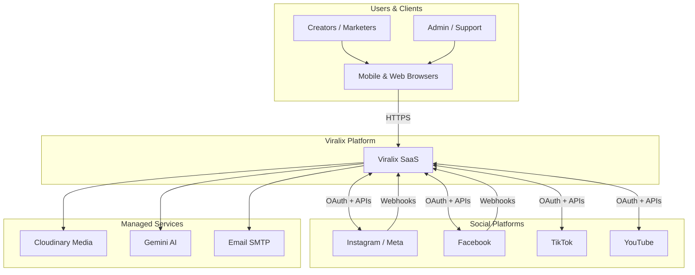


---

## 2) Container Architecture (C4 Level 2)

Major deployable units and how they connect.

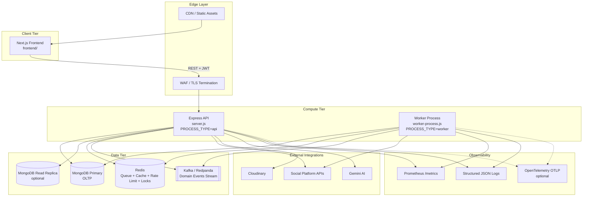


---

## 3) Deployment Topology

How processes scale in production (Heroku, Kubernetes, or Docker Compose).

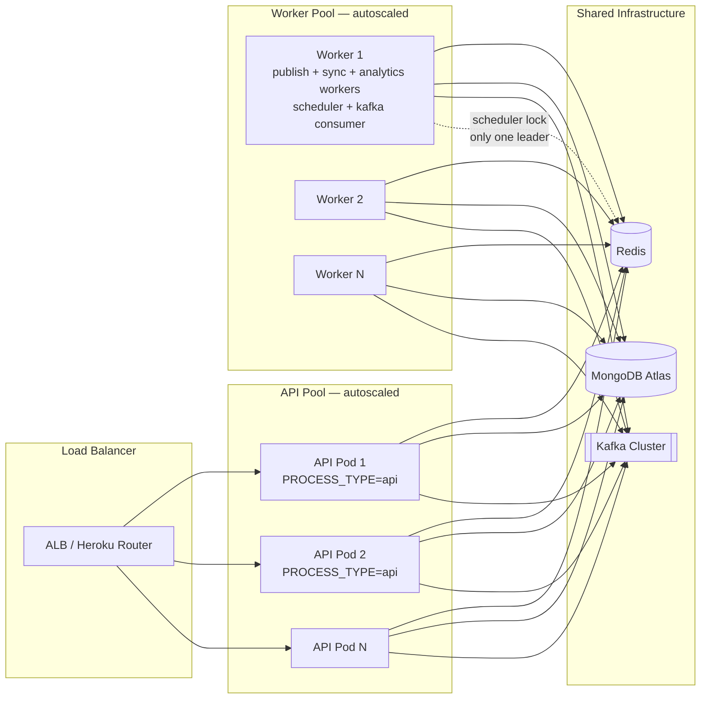


**Key split:** API handles HTTP only; workers handle Bull queues, cron scheduler (with distributed lock), and optional Kafka consumer.

---

## 4) Modular Monolith — Internal Structure

Domain modules inside the backend monolith and their seams for future extraction.

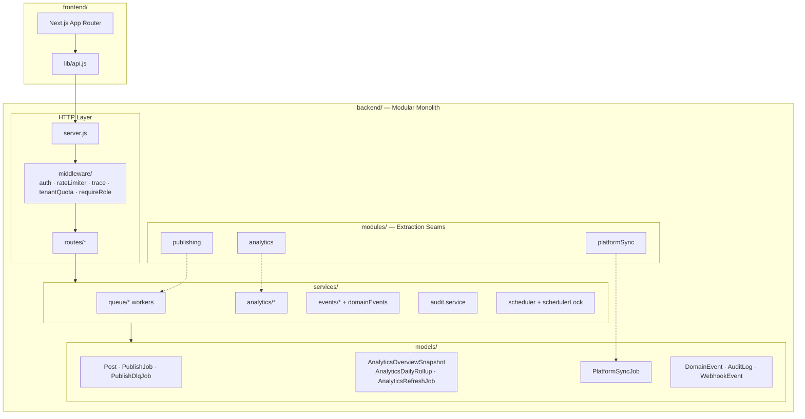


---

## 5) API Request Lifecycle

Path of an authenticated request through cross-cutting concerns.

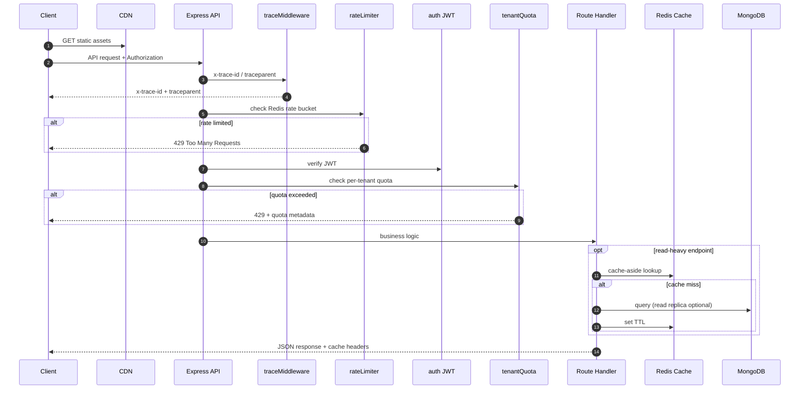


---

## 6) Publishing Pipeline

End-to-end flow from publish request to platform APIs and domain events.

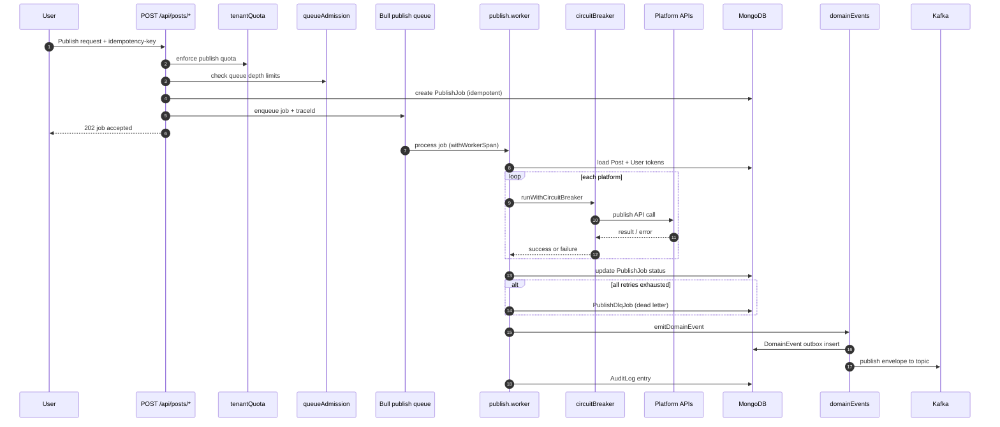


---

## 7) Analytics Pipeline

Async refresh, materialization, rollups, and read paths.

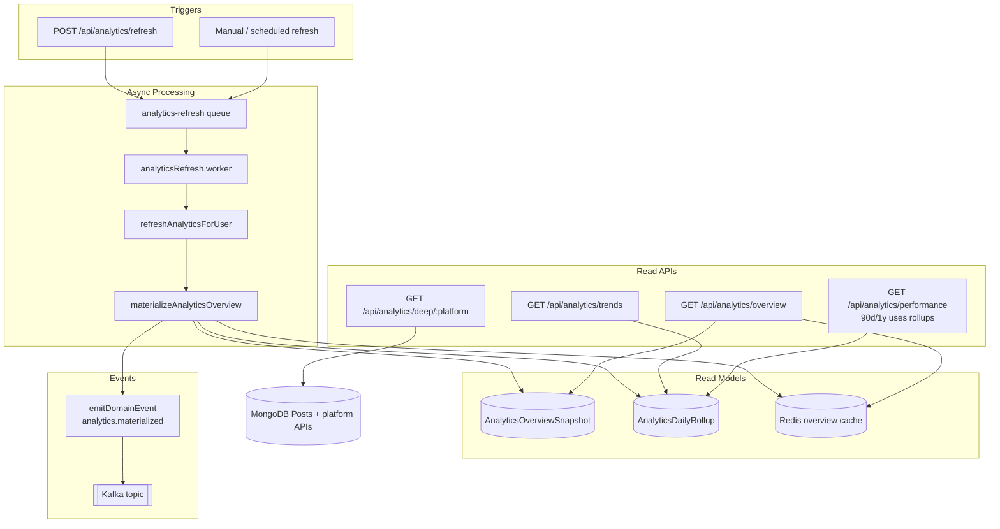


---

## 8) Platform Sync Pipeline

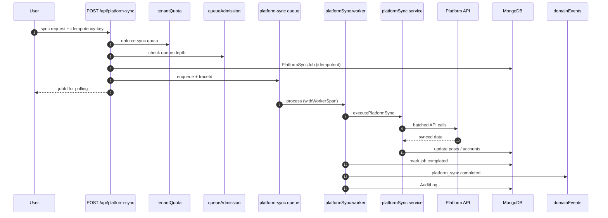


---

## 9) Domain Events — Outbox + Kafka

Reliable event emission pattern (outbox-lite) with Kafka as the stream backbone.

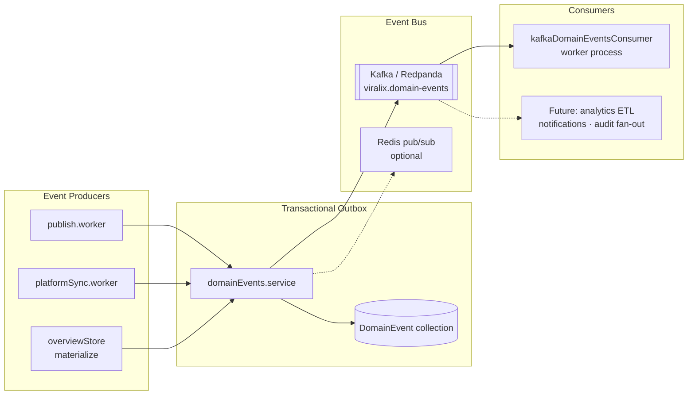


**Event envelope fields:** `eventId`, `eventType`, `userId`, `traceId`, `aggregateType`, `aggregateId`, `payload`, `version`.

**Partition key:** `userId` (per-tenant ordering within partition).

---

## 10) Queue Topology (Bull + Redis)

Partitioned job queues with admission control and DLQ.

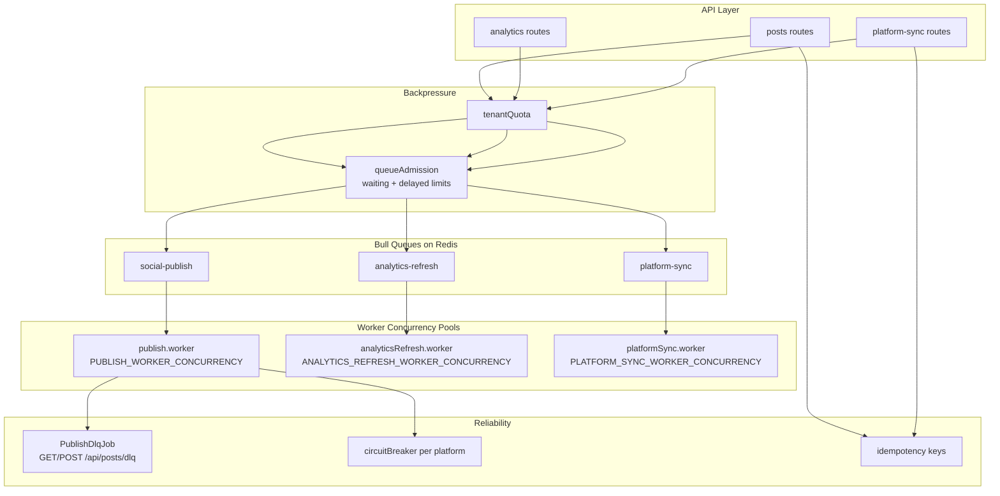


---

## 11) Scheduler — Distributed Singleton

Prevents duplicate scheduled-post execution across replicas.

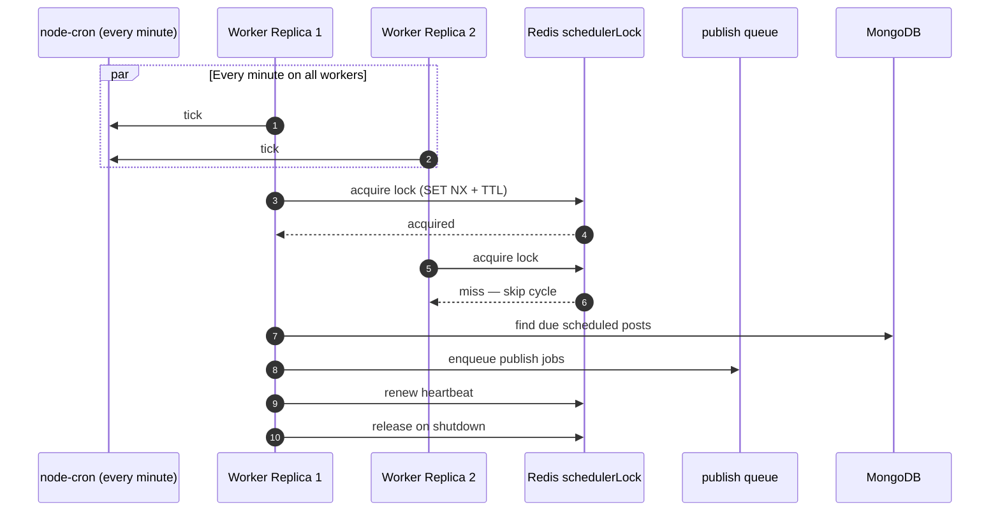


---

## 12) Webhook Ingestion

Idempotent processing of Instagram/Facebook webhook events.

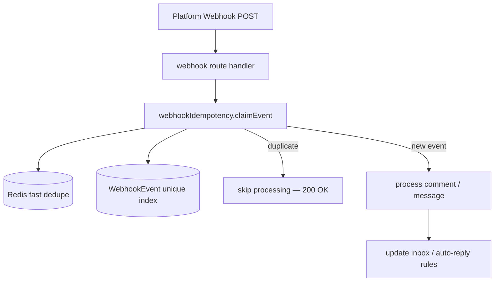


---

## 13) Caching & Read Replica Strategy

```mermaid
flowchart TB
    subgraph Reads["Read Paths"]
        R1[/api/analytics/overview]
        R2[/api/platforms/connected]
        R3[/api/audit/logs]
        R4[/api/analytics/trends]
    end

    subgraph Cache["Redis Cache-Aside"]
        C1[overview cache<br/>ANALYTICS_OVERVIEW_CACHE_TTL_SEC]
        C2[accounts cache<br/>ACCOUNTS_CACHE_TTL_SEC]
    end

    subgraph DB["MongoDB"]
        PRIMARY[(Primary — writes)]
        REPLICA[(Read Replica<br/>MONGODB_READ_URI)]
    end

    R1 --> C1
    C1 -->|miss| REPLICA
    R1 -->|materialized| SNAP[(AnalyticsOverviewSnapshot)]

    R2 --> C2
    C2 -->|miss| PRIMARY

    R3 --> REPLICA
    R4 --> REPLICA
    R4 --> ROLLUP[(AnalyticsDailyRollup)]

    WRITE[All writes] --> PRIMARY
```


---

## 14) Data Storage Map

Primary collections and their roles (simplified).

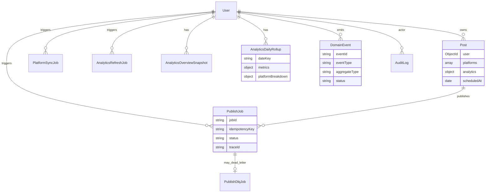


---

## 15) Observability Architecture

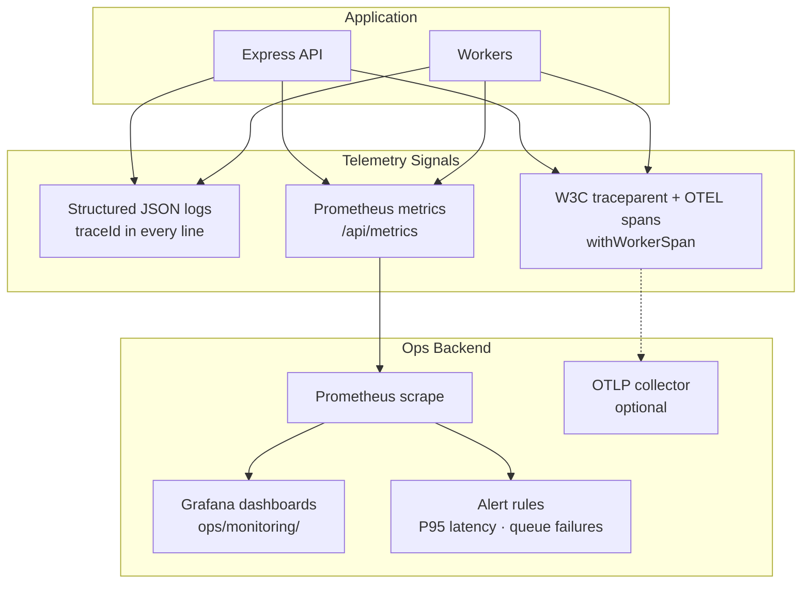


**Key metrics:** `viralix_http_request_duration_ms`, `viralix_queue_depth`, `viralix_queue_job_duration_ms`, `viralix_scheduler_lock_events_total`.

---

## 16) Security & Multi-Tenancy Boundaries

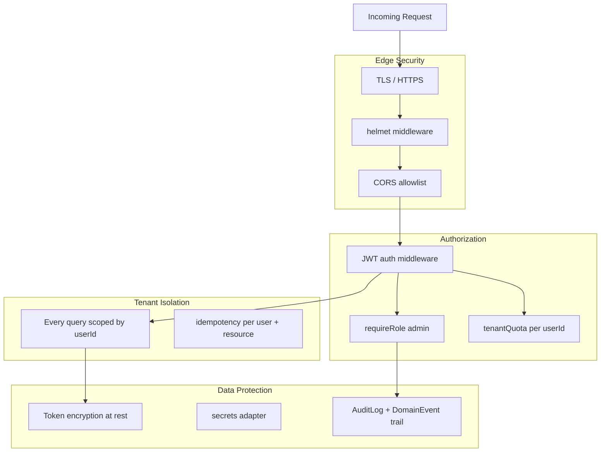


---

## 17) Analytical Data Flow (Current + Future)

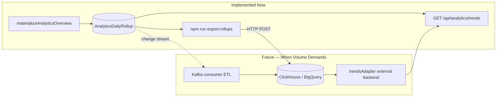


---

## 18) Evolution Path — Modular Monolith to Selective Services

Recommended extraction order when scale or team boundaries require it.

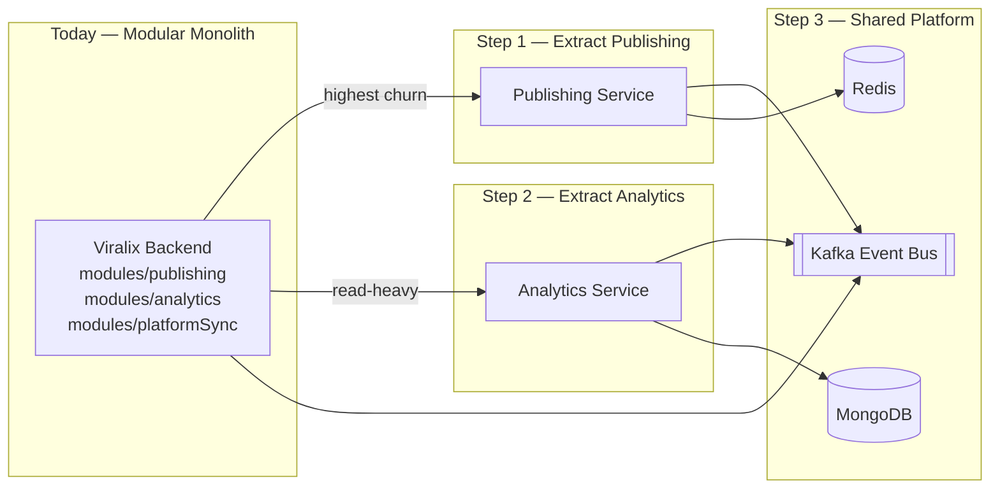


**Rule:** extract only after queues, cache, observability, and idempotency are mature — all of which are in place today.

---

## 19) Phase Rollout Map

What was built in each phase (implementation status).

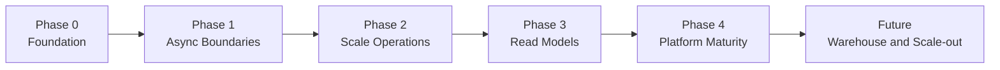

| Phase | Status | Deliverables |
|-------|--------|--------------|
| **Phase 0 — Foundation** | Done | Redis rate limiting, scheduler distributed lock, structured logs, trace IDs, Prometheus metrics, alerts |
| **Phase 1 — Async Boundaries** | Done | Queue partitioning, async analytics refresh, async platform sync, idempotency keys, materialized analytics, cache-aside Redis |
| **Phase 2 — Scale Operations** | Done | Read replicas, per-tenant quotas, DLQ replay, circuit breaker, load and chaos drills, hot-path indexes |
| **Phase 3 — Advanced Read Models** | Done | Domain events outbox, daily rollups, trends API, module boundaries |
| **Phase 4 — Platform Maturity** | Done | OTEL tracing hooks, rollup export stub, Kafka domain events |
| **Future** | Planned | ClickHouse or BigQuery, full microservices, multi-region active-active |


---

## 20) Local Development Topology

Docker Compose services for local scale testing.

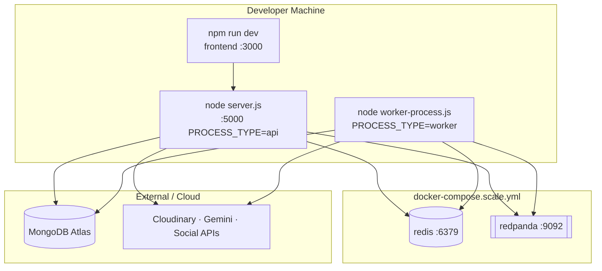


**Start infra:**

```bash
docker compose -f backend/ops/deploy/docker-compose.scale.yml up -d redis kafka
```

---

## Diagram Index


| #   | Diagram                  | Purpose                               |
| --- | ------------------------ | ------------------------------------- |
| 1   | System Context           | External actors and dependencies      |
| 2   | Container Architecture   | Deployable units and data stores      |
| 3   | Deployment Topology      | API vs worker scaling                 |
| 4   | Modular Monolith         | Code structure and module seams       |
| 5   | API Request Lifecycle    | Middleware and cross-cutting concerns |
| 6   | Publishing Pipeline      | Publish queue end-to-end              |
| 7   | Analytics Pipeline       | Refresh, materialize, read paths      |
| 8   | Platform Sync Pipeline   | Async sync flow                       |
| 9   | Domain Events            | Outbox + Kafka pattern                |
| 10  | Queue Topology           | Bull queues, DLQ, backpressure        |
| 11  | Scheduler Lock           | Singleton cron across replicas        |
| 12  | Webhook Ingestion        | Idempotent webhook handling           |
| 13  | Caching & Read Replicas  | Cache-aside and read routing          |
| 14  | Data Storage Map         | Core MongoDB collections              |
| 15  | Observability            | Logs, metrics, traces                 |
| 16  | Security & Multi-Tenancy | Auth, quotas, isolation               |
| 17  | Analytical Data Flow     | Rollups now, warehouse later          |
| 18  | Evolution Path           | Monolith to selective services        |
| 19  | Phase Rollout Map        | Implementation timeline               |
| 20  | Local Development        | Docker Compose dev setup              |


---

## Related Documents

- [SYSTEM_DESIGN_MILLION_USERS_PLAN.md](./SYSTEM_DESIGN_MILLION_USERS_PLAN.md) — decisions, yes/no matrix, runbooks, env vars
- [backend/ops/monitoring/](./backend/ops/monitoring/) — Prometheus, Grafana, alerts
- [backend/ops/deploy/](./backend/ops/deploy/) — Docker, Kubernetes, Render manifests

